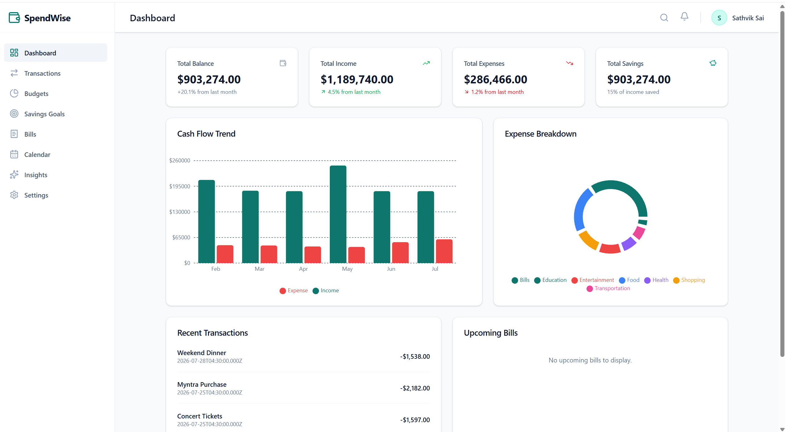
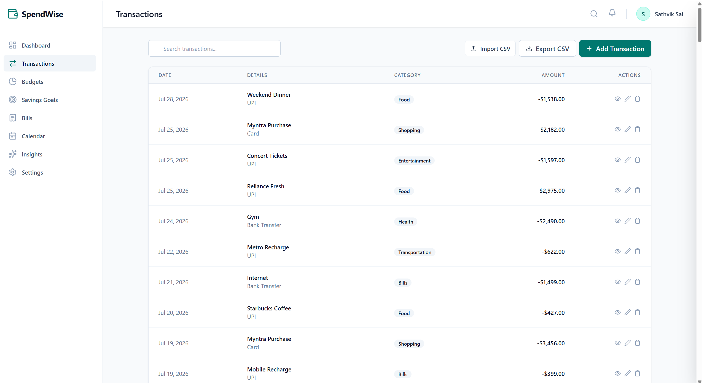
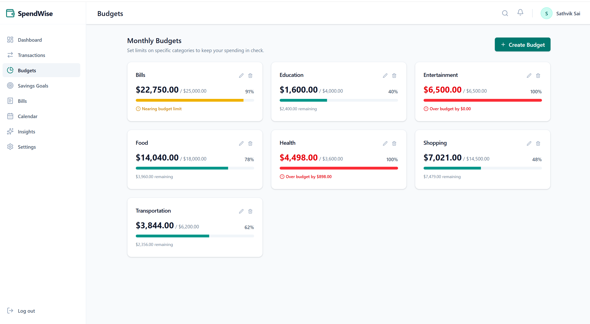
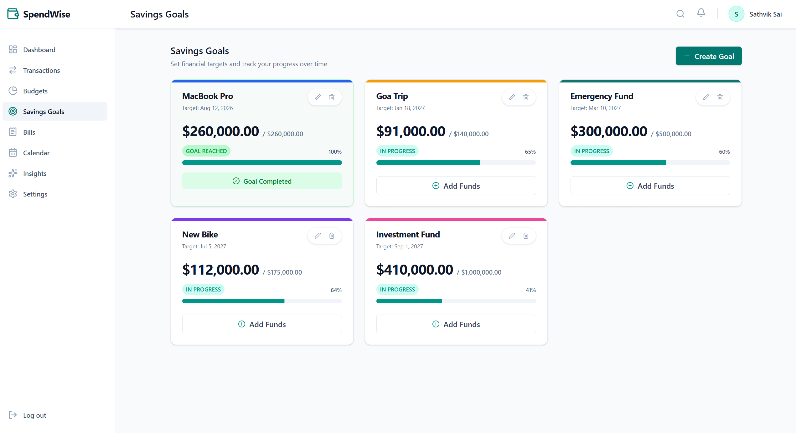
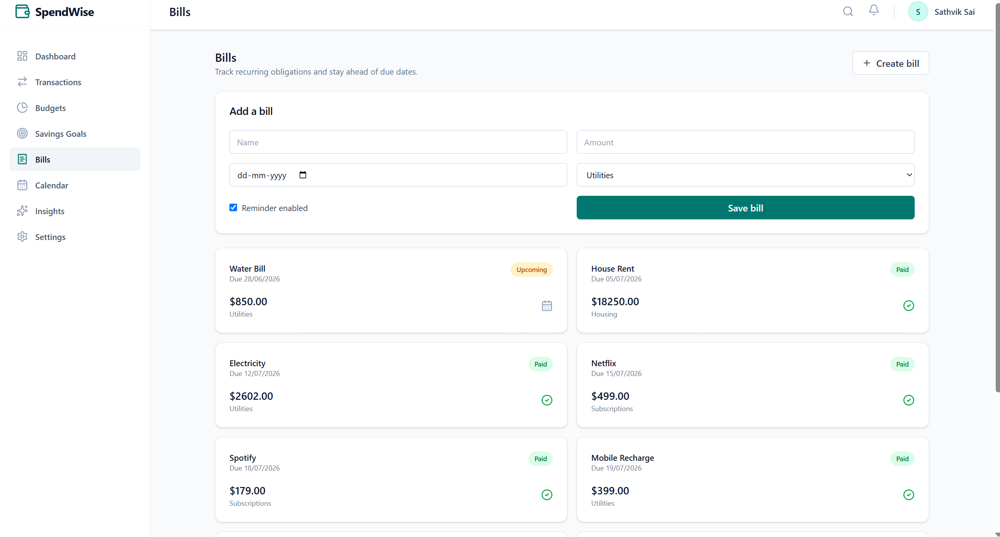
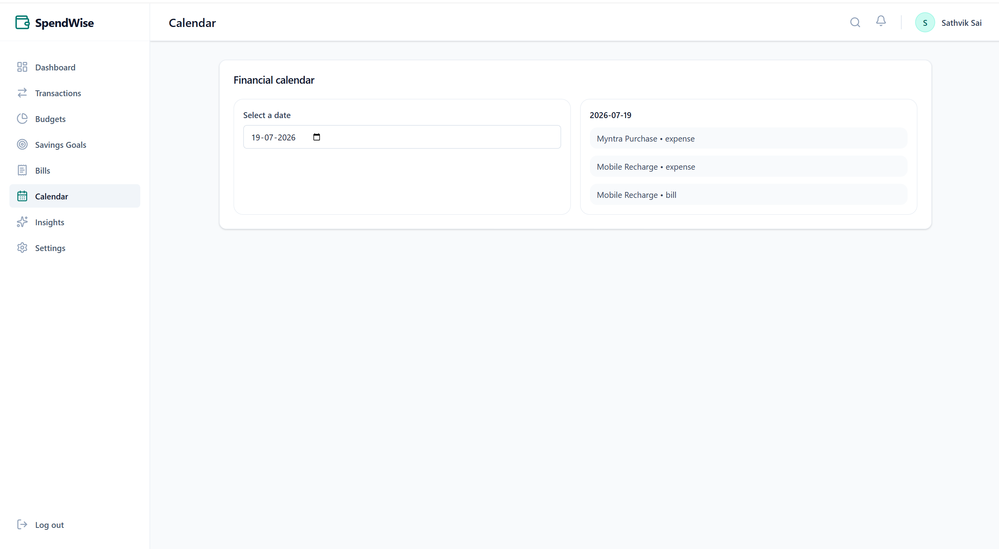
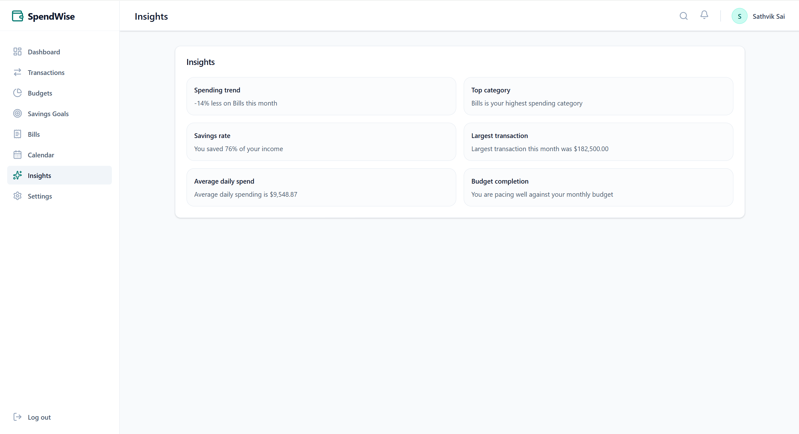
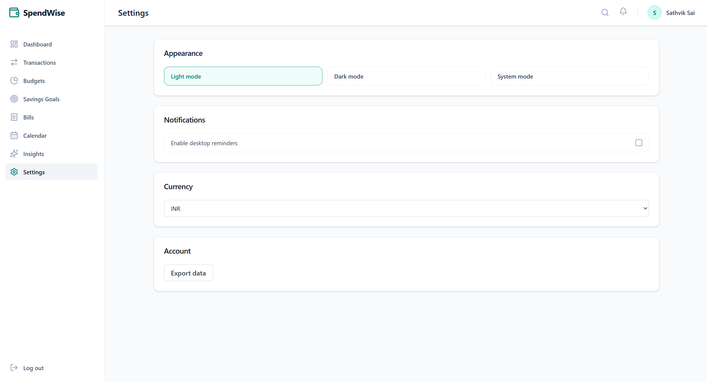

<div align="center">

# 💰 SpendWise

### A modern full-stack personal finance management platform built with the MERN stack.

Track your income, expenses, budgets, savings goals, bills and financial insights from one centralized dashboard.

---


</div>

---

# 🌐 Live Demo

### Frontend

https://spend-wise-beta-one.vercel.app/

### Backend API

https://spendwise-backend-22ab.onrender.com

---

# 📖 Overview

SpendWise is a complete personal finance management platform designed to help users monitor their financial health through an intuitive dashboard.

The application allows users to:

- Track income and expenses
- Create monthly budgets
- Manage savings goals
- Monitor recurring bills
- View financial insights
- Analyze spending patterns
- Export financial data
- Import transactions through CSV
- Access everything securely using JWT Authentication

The application follows a clean client-server architecture using React on the frontend and Express + MongoDB on the backend.

---

# ✨ Features

## 🔐 Authentication

- User Registration
- Secure Login
- JWT Authentication
- Protected Routes
- Password Encryption using bcrypt

---

## 📊 Dashboard

- Total Balance
- Total Income
- Total Expenses
- Total Savings
- Cash Flow Analytics
- Expense Breakdown Chart
- Recent Transactions
- Upcoming Bills

---

## 💳 Transaction Management

- Add Transactions
- Edit Transactions
- Delete Transactions
- Search Transactions
- Expense Categories
- Income Categories
- CSV Import
- CSV Export

---

## 💰 Budget Management

- Create Monthly Budgets
- Edit Budgets
- Delete Budgets
- Budget Progress Bars
- Remaining Budget Calculation
- Budget Limit Warnings

---

## 🎯 Savings Goals

- Create Goals
- Track Goal Progress
- Goal Completion Percentage
- Add Funds
- Edit Goals
- Delete Goals

---

## 📅 Bills Management

- Create Bills
- Due Date Tracking
- Paid / Pending Status
- Reminder Toggle
- Bill Categories

---

## 🗓 Financial Calendar

- Calendar View
- Expense Timeline
- Bill Timeline
- Daily Financial Events

---

## 📈 Financial Insights

- Spending Trends
- Top Spending Category
- Savings Rate
- Largest Transaction
- Average Daily Spending
- Budget Performance

---

## ⚙ Settings

- Light Mode
- Dark Mode
- System Theme
- Currency Selection
- Notification Settings
- Data Export

---

# 🖼 Screenshots

## Dashboard



---

## Transactions



---

## Budgets



---

## Savings Goals



---

## Bills



---

## Calendar



---

## Insights



---

## Settings



---

# 🏗 Tech Stack

## Frontend

- React 19
- React Router DOM
- Axios
- Tailwind CSS v4
- React Hook Form
- Recharts
- Lucide React
- React Hot Toast
- XLSX

---

## Backend

- Node.js
- Express.js
- MongoDB
- Mongoose
- JWT
- bcryptjs
- Multer
- Cloudinary
- Validator

---

## Database

- MongoDB Atlas

---

## Deployment

Frontend

- Vercel

Backend

- Render

Database

- MongoDB Atlas

---

# 📂 Project Structure

```
SpendWise
│
├── backend
│   ├── config
│   ├── controllers
│   ├── middleware
│   ├── models
│   ├── routes
│   ├── scripts
│   ├── utils
│   └── server.js
│
├── frontend
│   ├── public
│   ├── src
│   ├── components
│   ├── pages
│   ├── hooks
│   ├── context
│   ├── services
│   └── assets
│
└── README.md
```

---

# 🔄 Application Flow

```
User

↓

React Frontend

↓

Axios API Calls

↓

Express Server

↓

JWT Authentication

↓

Controllers

↓

MongoDB Atlas

↓

Response

↓

Frontend UI
```

---

# 🚀 Installation

Clone the repository

```bash
git clone https://github.com/YOUR_USERNAME/SpendWise.git
```

Navigate into the project

```bash
cd SpendWise
```

---

## Backend

```bash
cd backend

npm install

npm run dev
```

---

## Frontend

```bash
cd frontend

npm install

npm run dev
```

---

# 🔑 Environment Variables

Backend

```
MONGO_URI=

JWT_SECRET=

CLOUDINARY_CLOUD_NAME=

CLOUDINARY_API_KEY=

CLOUDINARY_API_SECRET=
```

Frontend

```
VITE_API_URL=http://localhost:4000
```

---

# 📊 Charts Used

- Cash Flow Analysis
- Expense Distribution
- Budget Progress
- Savings Progress

Powered by **Recharts**

---

# 🔒 Security Features

- JWT Authentication
- Password Hashing
- Protected API Routes
- Environment Variables
- Secure Password Storage
- MongoDB Validation

---

# 📈 Performance Highlights

- Modular MVC Architecture
- Responsive UI
- Optimized React Components
- Reusable Components
- RESTful APIs
- Clean Folder Structure

---

# 🎯 Future Improvements

- Email Verification
- Forgot Password
- Google Authentication
- Recurring Transactions
- Notifications
- Mobile App
- AI Spending Recommendations
- Investment Tracker

---

# 👨‍💻 Author

**Sathvik Sai**

GitHub

https://github.com/sathvik6606

---

# ⭐ Support

If you like this project,

⭐ Star the repository

🍴 Fork the repository

🛠 Contribute to improve SpendWise

---

<div align="center">

### Thank you for visiting SpendWise ❤️

</div>
